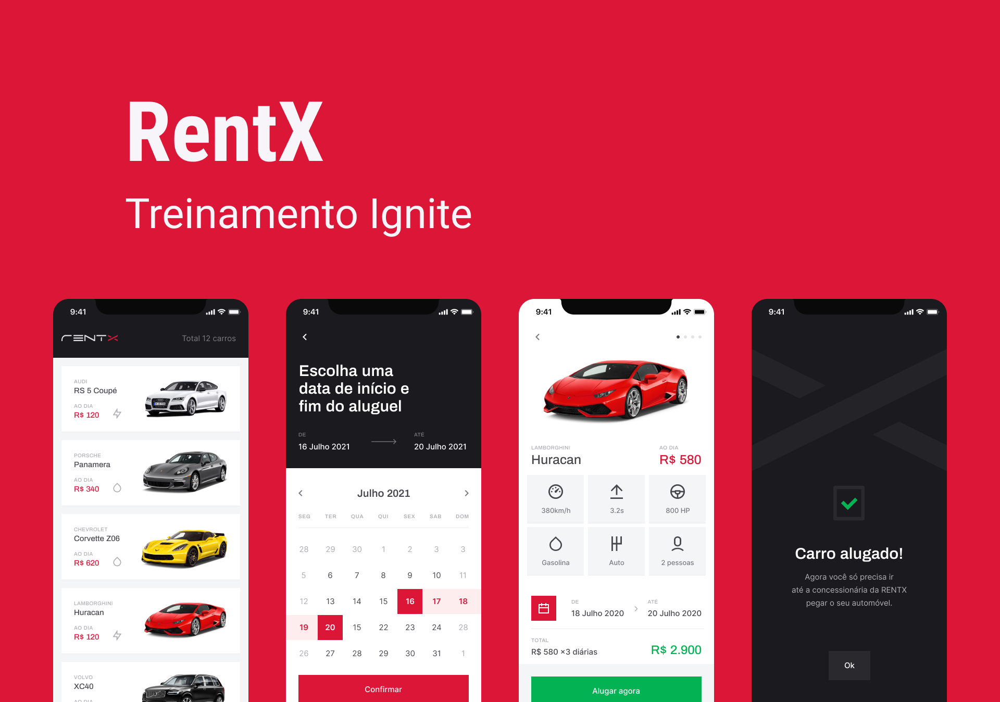

<h1 align="center">
  
</h1>

<p align="center">
  
       
  
</p>



## 💻 Project

RentX is an app to make car bookings, it has an optimistic interface and the Offline First implementation using WatermelonDB.

## :hammer_and_wrench: Features

- [x] Local data storage
- [x] Offline First

## 🚀 Techs

- [x] [React Native](https://reactnative.dev)
- [x] [Expo](https://docs.expo.dev)
- [x] [TypeScript](https://www.typescriptlang.org)
- [x] [WatermelonDB](https://github.com/Nozbe/WatermelonDB)

## 💻 Run project

The app execution must be done with the commands listed below, and not with expo start, because of native modifications that had to be done for Offline First to work with WatermelonDB.

> Set your local IP Address on baseUrl to API working

Configure your IP on **api.ts** file: **ignite-project-rentx**/**mobile**/**src**/**services**/**api.ts**

```bash
# Open terminal and clone this repository
$ git clone https://github.com/Sup3r-Us3r/ignite-project-rentx.git

# Install dependencies for the server
$ cd ignite-project-rentx/server
$ npm install
# or
$ yarn install

# Start the server
$ npm run start
# or
$ yarn start

# Install dependencies for the app
$ cd ignite-project-rentx/mobile
$ npm install
# or
$ yarn install

# Start the application
$ npx react-native start
$ npx react-native run-android
```
